<h1 align="center">Hi there, I'm Becuda!
</h1>
<h3 align="center">Python Developer</h3>

  

  I am a passionate Python developer. I enjoy solving real-world problems through code,  from automated data scraping to containerized microservices.

> **Currently focused on:** Backend Development (FastAPI, PostgreSQL, Asyncio) and DevOps basics.

> 🎯 **GOAL:** Joining a forward-thinking team as a Junior Backend Developer to build high-quality software.

---

## 🛠️ Tech Stack & Tools
<ul>
  <li>Languages: C++, Python (3.11+), SQL</li> 
  <li>Frameworks & Libraries: FastAPI, SQLAlchemy, Pydantic, Pytest</li> 
  <li>Data Scraping & Automation: BeautifulSoup, Selenium, Requests, Custom Parsers</li> 
  <li>DevOps & Tools: Docker, Git, GitHub</li> 
</ul>

<!--
### 📈 GitHub Stats

  

-->
<!-- 

  

 -->
<!--<h3 align="center">Мой стек технологий</h3>

<!-- 

  <em>Языки, на которых я пишу и создаю:</em>
   
   
  
  
  
  

  <em>Фреймворки и платформы, с которыми я работаю:</em>
   
   
  
  

  <em>Инструменты, которые я использую:</em>
   
   
  

 -->
